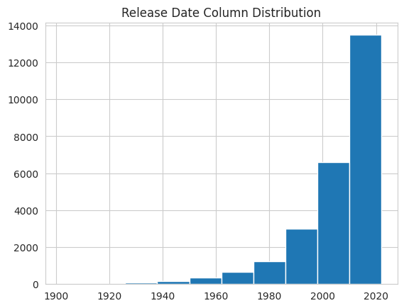
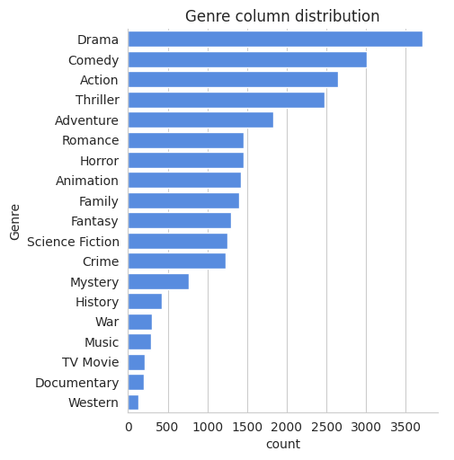
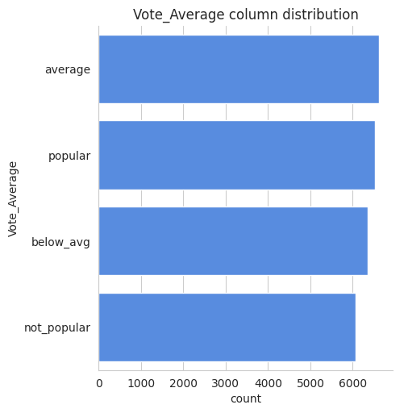

# 📊 Netflix Movies Data Analysis

## 🔍 Project Overview
This project provides an in-depth analysis of the **Netflix Movies dataset** using Python.  
The goal is to uncover key insights and trends about movies available on Netflix through data cleaning, preprocessing, and exploratory data analysis (EDA).  

The notebook answers **five core analytical questions** about Netflix movies after a comprehensive preprocessing pipeline.

---

## 🧰 Tools and Technologies
- **Language:** Python  
- **Environment:** Jupyter Notebook  
- **Libraries Used:**
  - Pandas  
  - NumPy  
  - Matplotlib  
  - Seaborn  

---

## 🧹 Data Preprocessing
The dataset underwent extensive cleaning and transformation before analysis:
- Converted **`release_date`** to appropriate `datetime` format.  
- Handled **missing values** in critical columns.  
- Used **string splitting techniques** to separate multiple genres in the `genre` column.  
- Renamed columns for better readability and standardized data types.  

These steps ensured accurate and meaningful insights during analysis.

---

## ❓ Key Analytical Questions
The notebook explores and answers the following:
1. **What is the most frequent genre of movies released on Netflix?**  
2. **Which has highest votes in vote avg column?**  
3. **What movie got the highest popularity? what's its genre?**  
4. **What movie got the lowest popularity? what's its genre?**  
5. **Which year has the most filmed movies?**

 

Each question is supported with clear visualizations and data-driven insights.

---

## 📸 Visualizations

Below are some of the visual insights generated during the analysis:

### 🎬 Distribution of Movie Release Dates


### 🎭 Most Frequent Genres


### 🎭 Votes Distribution



## ⚙️ How to Run the Project
1. Clone this repository:
   ```bash
   git clone https://github.com/sneha200421/Netflix-Movies-Data-Analytics.git
   cd Netflix-Movies-Data-Analytics
2. Install dependencies:

    ```bash
    pip install pandas numpy matplotlib seaborn
    ```
3. Open the notebook:

    ```bash
    jupyter notebook Netflix_Movies.ipynb
     ```
Run all cells to view the analysis and outputs.

## 📊 Results

The notebook provides well-structured insights into Netflix’s movie catalog, including:

1. Year-wise content trends

2. Genre preferences

3. Country-based contributions

4. Rating patterns

These results can support further predictive modeling or recommendation system development.
